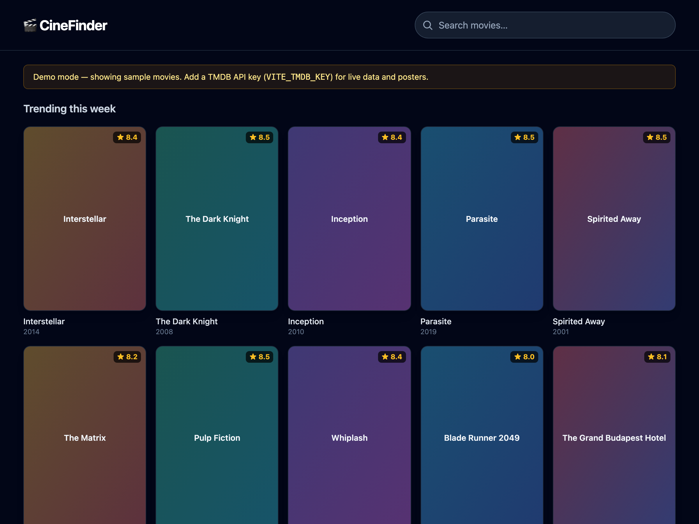

# CineFinder — Movie Catalog


A movie catalog built with **React + TypeScript**: browse trending films, search the
**TMDB** database, and open a details view — with fully typed API models, debounced
search, and graceful states.



## What this project demonstrates

- **TypeScript end to end** — typed API models (`Movie`, `MovieDetails`, TMDB responses),
  typed components, props and a generic `useDebounce<T>` hook.
- **Consuming a third-party REST API** (TMDB) with `fetch`, loading and error states.
- **Debounced search**, a responsive poster grid, and an accessible details modal
  (close on Escape or backdrop click, lazy-loaded images).
- **Graceful degradation** — with no API key the app runs in demo mode on bundled
  sample data, so it always works; with a key it fetches live data and posters.

## Features

- Trending movies grid
- Debounced movie search
- Details modal: rating, release year, runtime, genres, tagline, overview
- Demo-mode fallback (no backend, no key required)

## Tech

React 18 · TypeScript · Vite · Tailwind CSS · TMDB API

## Run locally

```bash
npm install
npm run dev      # http://localhost:5175
```

For **live data** (optional), get a free [TMDB API key](https://www.themoviedb.org/settings/api),
then copy `.env.example` to `.env.local` and set it:

```bash
VITE_TMDB_KEY=your_key_here
```

Type-check and build:

```bash
npm run typecheck
npm run build
```

## Attribution

This product uses the TMDB API but is not endorsed or certified by
[TMDB](https://www.themoviedb.org/).
